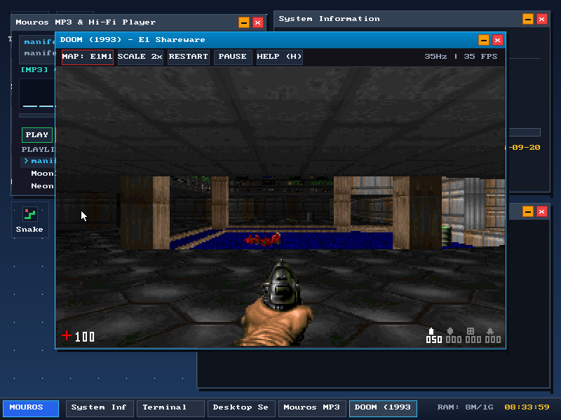
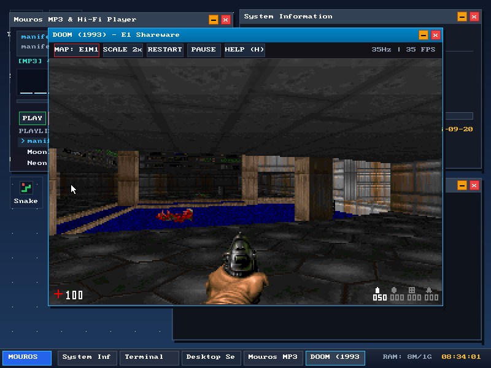
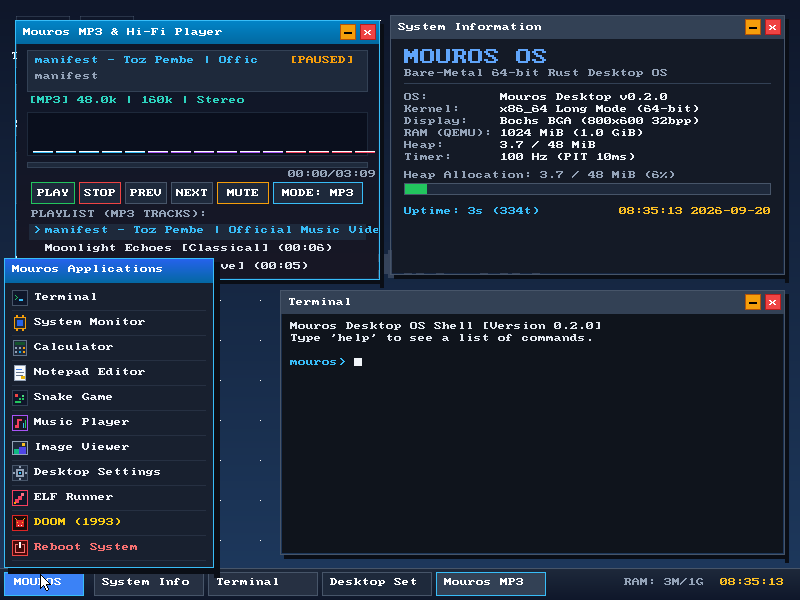
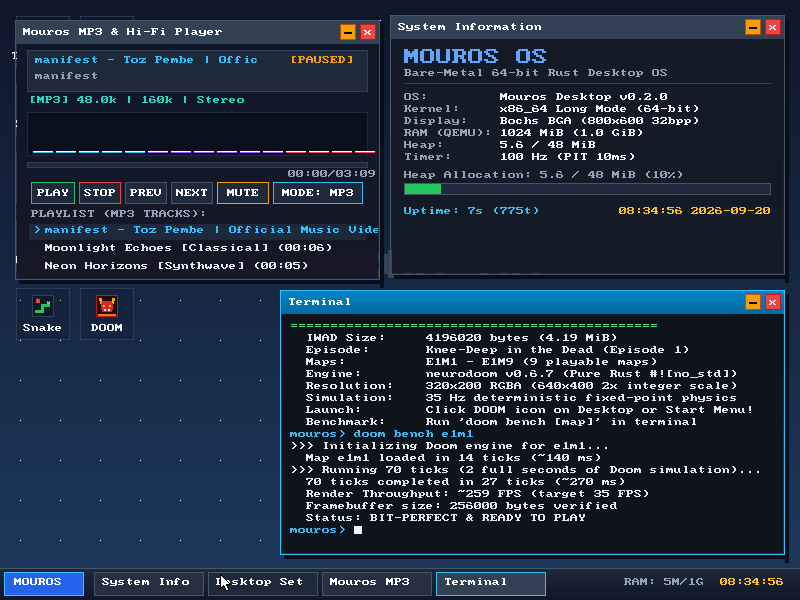

# Mouros OS

[](https://www.rust-lang.org/)
[](x86_64-mouros.json)
[](LICENSE-MIT)
[](tests/)

A modern, bare-metal 64-bit operating system written in pure Rust (`#![no_std]`). Features a true-color 800x600 graphical desktop compositor, an Intel AC97 PCI stereo audio engine with MP3 playback, a 64-bit ELF user-space application runner, and a native port of **DOOM (1993)** running at a locked 35 FPS.

---

## Screenshots

| DOOM (1993) Running in Window (640x400 @ 35 FPS) | Active 3D Gameplay & Pistol Firing |
| :---: | :---: |
|  |  |

| Start Menu & Multi-Window Desktop | Terminal DOOM Benchmark (~259 FPS) |
| :---: | :---: |
|  |  |

---

## Key Features

### 🎮 DOOM (1993) Engine Port
- **Authentic Shareware Dataset**: Embedded `DOOM1.WAD` (v1.9, 4.19 MB) featuring all Episode 1 levels (*Knee-Deep in the Dead*, `E1M1` through `E1M9`).
- **Pure `#![no_std]` Fixed-Point Engine**: Powered by `neurodoom` (v0.6.7) with 100% deterministic 16.16 integer fixed-point math and zero floating-point operations.
- **Fast 2x Integer Scaler**: Renders classic 320x200 RGBA at 2x integer scaling (640x400 viewport) with negligible CPU overhead (< 0.3 ms per frame).
- **Synchronized 35 Hz Ticking**: Hardware PIT timer accumulator advances physics and rendering at exact classic Doom tick rates.
- **Rich Controls**: Keyboard movement (WASD/arrows), strafing (Q/E or ,/.), firing (F/Ctrl/mouse click), doors/switches (Space/Enter), weapon selection (`1`–`7`), live map switching (`M`), pause (`P`), and an on-screen help modal (`H`).

### 🖥️ True-Color Graphical Desktop Compositor
- **Display Driver**: 800x600 32bpp True Color Bochs Graphics Adapter (BGA) linear framebuffer with double-buffering.
- **Window Manager**: Overlapping draggable windows, titlebar controls (minimize, close, focus), and dynamically scaled taskbar tabs.
- **Start Menu**: Windows-style application launcher with customized 16x16 pixel-art icons.
- **Theme Engine**: 4 live-switchable desktop themes:
  - **Deep Space** (Default navy/slate blue)
  - **Cyberpunk Neon** (Vibrant dark cyan/neon magenta)
  - **Matrix Emerald** (Hacker terminal phosphor green)
  - **Retro Sunset** (Warm purple/sunset orange gradient)
- **Smooth Mouse & RTC**: Responsive PS/2 mouse cursor with background restoration and hardware CMOS RTC clock.

### 🎵 Intel AC97 PCI Audio & MP3 Player
- **Hardware Driver**: Intel 82801AA AC97 PCI controller driver managing circular Buffer Descriptor Lists (BDL) with bus-master DMA transfers.
- **Host Sound Integration**: Seamless audio streaming through host PulseAudio or PipeWire sinks.
- **MP3 Decoding**: Pure-Rust integer MPEG-1 Layer 3 decoder with ID3v2 tag parsing (title, artist, genre, bitrate, sample rate).
- **GUI Music Player**: Play/pause, track navigation, volume mute, and real-time 12-band animated FFT audio spectrum visualizer.
- **PC Speaker Fallback**: Square-wave PIT channel 2 audio engine when PCI audio hardware is not present.

### ⚡ 64-bit ELF Execution Subsystem
- Static ELF64 binary parser with segment allocation, page-table mapping, and ring-transition syscall dispatch.
- Bundled C sample binaries:
  - `hello.elf`: User-space greeting and standard output test
  - `fibonacci.elf`: High-iteration Fibonacci sequence generator
  - `mandelbrot.elf`: ASCII Mandelbrot fractal renderer
  - `sysbench.elf`: CPU & memory bandwidth performance benchmark

### 🧠 Robust Memory Management
- Recursive 4-level x86_64 page tables with physical frame allocation.
- Dynamic kernel heap scaling up to **48 MiB** based on detected usable physical RAM.
- Hybrid allocator: Fast fixed-size block allocator for small objects, backed by a linked-list allocator for larger allocations.

---

## Desktop Applications

| Application | Description |
| :--- | :--- |
| **DOOM (1993)** | Classic 3D first-person shooter with shareware Episode 1 |
| **Music Player** | Hi-Fi MP3 player with playlist support and animated visualizer |
| **Terminal** | Interactive command shell with hardware diagnostics and benchmarking |
| **System Monitor** | Live CPU uptime, physical RAM, and kernel heap allocation statistics |
| **Calculator** | Arithmetic calculation utility with interactive button grid |
| **Notepad Editor** | Multi-line text editor with cursor editing and word count |
| **Snake Game** | Retro arcade game with high score tracking |
| **Image Viewer** | BMP gallery viewer with 1x/2x zoom and image filters (grayscale, sepia, invert) |
| **Desktop Settings**| Desktop personalization suite and theme switcher |
| **ELF Runner** | GUI launcher and output viewer for 64-bit user-space ELF binaries |

---

## Getting Started

### Prerequisites

On Arch Linux / Debian / Ubuntu, ensure the following tools are installed:

```bash
# Arch Linux
sudo pacman -S qemu-system-x86 xorriso mtools rustup

# Ubuntu / Debian
sudo pacman -S qemu-system-x86 xorriso mtools   # or apt install on Debian/Ubuntu
```

Ensure Rust nightly is installed with the required target components:

```bash
rustup toolchain install nightly
rustup component add rust-src --toolchain nightly
rustup component add llvm-tools-preview --toolchain nightly
```

### Building the OS

Clone the repository and build the bootable ISO:

```bash
git clone https://github.com/abjdev/mouroos.git
cd mouroos

# Build kernel and generate bootable mouros.iso
./tools/create_iso.sh
```

### Running with QEMU

To run Mouros OS with full graphics, 1G RAM, and **PulseAudio sound**:

```bash
qemu-system-x86_64 \
  -cdrom mouros.iso \
  -boot d \
  -m 1G \
  -vga std \
  -device AC97,audiodev=snd0 \
  -audiodev pa,id=snd0,server=/run/user/1000/pulse/native
```

*(Note: If using PipeWire without a separate PulseAudio socket, `-audiodev pipewire,id=snd0` can also be used).*

---

## Controls

### DOOM Controls

| Action | Primary Key | Alternative / Mouse |
| :--- | :--- | :--- |
| **Walk Forward** | `W` | `Up Arrow` |
| **Walk Backward** | `S` | `Down Arrow` |
| **Turn Left / Right** | `A` / `D` | `Left / Right Arrow` |
| **Strafe Left / Right** | `Q` / `E` | `,` / `.` |
| **Fire Weapon** | `F` | `Left Click` or `Ctrl` |
| **Open Doors / Switches** | `Space` | `Enter` |
| **Select Weapon** | `1` to `7` | — |
| **Next Map (E1M1–E1M9)** | `M` | Toolbar `[MAP: ...]` button |
| **Scale Viewport (1x / 2x)** | `Z` | Toolbar `[SCALE 2x]` button |
| **Pause / Resume** | `P` | Toolbar `[PAUSE]` button |
| **Restart Level** | `R` | Toolbar `[RESTART]` button |
| **Controls Help Overlay** | `H` | Toolbar `[HELP (H)]` button |

### Desktop Shortcuts

- **Start Menu**: Click **MOUROS** button or press mouse on bottom-left.
- **Window Management**: Click and drag titlebars to move windows; click `—` to minimize, `×` to close.
- **Terminal Shell**: Type `help` to list all available commands (`sysinfo`, `mem`, `theme`, `mp3`, `doom`, `elf`, `calc`).

---

## Testing & Verification

Run the entire kernel unit test suite inside headless QEMU:

```bash
cargo test
```

All 11 test suites test:
- Breakpoint and page-fault exception handling
- VGA and serial text buffers
- Heap allocation stress testing (thousands of boxes, reallocations, large vectors)
- Stack overflow guard page protection
- Should-panic verification

---

## License

Dual-licensed under either:
- **MIT License** ([LICENSE-MIT](LICENSE-MIT))
- **Apache License, Version 2.0** ([LICENSE-APACHE](LICENSE-APACHE))

at your option.
